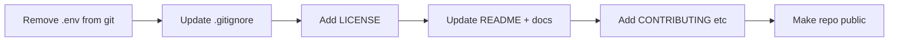

# Plan: Making the project open source

## Current state

- **Repo:** `goat-linear` (GitHub: `ajith-m-doodlebug/goat-linear`), main app in [llm-builder/](llm-builder/) — self-hosted AI platform (Next.js + FastAPI, Docker).
- **Missing:** No LICENSE, no CONTRIBUTING, root [README.md](README.md) is minimal.
- **Risk:** [llm-builder/.env](llm-builder/.env) is **tracked in git**; it must be removed from the repo and never committed again.

---

## 1. Security and secrets (do first)

- **Stop tracking `llm-builder/.env`**
  - Run: `git rm --cached llm-builder/.env` (keeps the file locally, removes it from the index).
  - Add `llm-builder/.env` and `.env` to the **root** [.gitignore](.gitignore) so it is ignored from the repo root as well (frontend/backend already ignore `.env`; root does not).
- **Assume secrets were exposed:** If `.env` ever contained real `SECRET_KEY`, `QDRANT_API_KEY`, or other secrets, treat them as compromised and rotate them anywhere they are used (and document in README that deployers must set their own).
- **Keep only `.env.example` in git:** Already present with safe placeholders; ensure all required variables are documented there.

---

## 2. License and legal

- **Choose a license** (common choices):
  - **MIT** — minimal conditions, very permissive.
  - **Apache 2.0** — permissive + patent grant and contribution clarity.
  - **AGPL-3.0** — copyleft; modified/network services must share source (strong for “product as a service”).
- **Add a LICENSE file** at the repository root with the chosen license text and correct year/copyright holder name.
- **Add license field** to [llm-builder/frontend/package.json](llm-builder/frontend/package.json) (e.g. `"license": "MIT"`) and remove or set `"private": false` if you intend to publish the frontend package (optional).

---

## 3. Documentation for public release

- **Root README:** Expand [README.md](README.md) to clearly describe the project (e.g. “LLM Builder — self-hosted AI platform”), link to [llm-builder/README.md](llm-builder/README.md) for setup/usage, and mention license and how to contribute (or link to CONTRIBUTING).
- **Deployment security:** In README or [llm-builder/docs/](llm-builder/docs/), state that users must set a strong `SECRET_KEY` and other secrets (no default production secrets).

---

## 4. Contribution and community (recommended)

- **CONTRIBUTING.md** (root or under `llm-builder/`): How to set up the dev environment, run tests, and submit PRs (branch naming, scope).
- **CODE_OF_CONDUCT.md:** Optional but recommended (e.g. Contributor Covenant).
- **Issue/PR templates:** Optional; add `.github/ISSUE_TEMPLATE/` and `.github/PULL_REQUEST_TEMPLATE.md` if you use GitHub.

---

## 5. Repository and hosting

- **GitHub:** Make the repo public; set description, topics (e.g. `self-hosted`, `llm`, `rag`, `docker`), and link to main README.
- **Default branch:** Decide whether `main` or `develop` is the default and document it in CONTRIBUTING/README.
- **Tags/releases:** Optionally create a first release (e.g. `v0.1.0`) from the open-source-ready commit for clarity.

---

## 6. Optional checks before going public

- **Audit for hardcoded secrets:** Search for real API keys, passwords, or tokens (you already use env-based config; double-check [llm-builder/backend/app/core/config.py](llm-builder/backend/app/core/config.py) and any deploy scripts).
- **Dependency licenses:** No strict requirement to ship a combined notice, but be aware of copyleft deps (e.g. GPL) if you chose a permissive license.
- **Branding:** If “goat-linear” or “LLM Builder” might conflict with existing names, consider a short naming note in the README.

---

## Order of operations (summary)

1. Remove `llm-builder/.env` from tracking and update root `.gitignore`.
2. Add LICENSE and (optional) package.json `license` / `private` updates.
3. Expand root README and add deployment/security note.
4. Add CONTRIBUTING (and optionally CODE_OF_CONDUCT, issue templates).
5. Make the repository public and set description/topics; optionally create a first release.

If you tell me your preferred license (MIT, Apache 2.0, or AGPL-3.0) and copyright holder name, the next step can be the exact text for LICENSE and the README/contributing snippets.